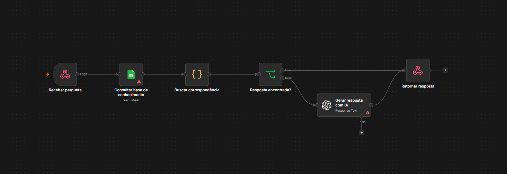

# 🤖 Chatbot Inteligente com n8n

Projeto de automação desenvolvido utilizando **n8n**, **OpenAI** e **Google Sheets** para responder automaticamente perguntas enviadas por uma API.
---

## Visão geral do workflow


---

## Objetivo

Demonstrar a criação de um chatbot inteligente capaz de:

- receber perguntas via Webhook;
- consultar uma base de conhecimento no Google Sheets;
- identificar respostas através de palavras-chave;
- utilizar a OpenAI quando não existir resposta cadastrada;
- retornar uma resposta em formato JSON.

---

## Tecnologias

- n8n
- OpenAI API
- Google Sheets API
- JavaScript
- REST API
- Webhooks
- JSON

---

## Fluxo da automação

```text
Cliente

↓

Webhook

↓

Google Sheets

↓

Busca por palavras-chave

↓

Resposta encontrada?

├── Sim
│
└── Retorna resposta

↓

Não encontrou

↓

OpenAI

↓

Retorna resposta
```

---

## Estrutura do projeto

```
n8n-automacao
│
├── README.md
│
└── workflows
    └── chatbot-google-sheets.json
```

---

## Como utilizar

1. Importe o arquivo `chatbot-google-sheets.json` no n8n.
2. Configure as credenciais da OpenAI.
3. Configure a credencial do Google Sheets.
4. Informe o ID da sua planilha.
5. Execute o workflow.

---

## Funcionalidades

✅ Consulta automática na base de conhecimento

✅ Busca por palavras-chave

✅ Integração com OpenAI

✅ Resposta em JSON

✅ Fácil adaptação para APIs externas

---

## Autor

**Taioni Terres**

Profissional de Tecnologia da Informação com experiência em:

- Automação
- Infraestrutura
- Integração de APIs
- Suporte Técnico
- Inteligência Artificial
- n8n
